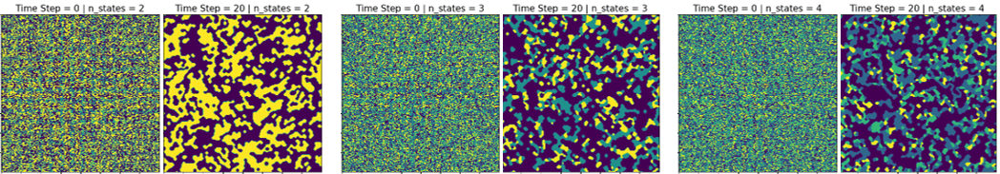

# Clustering of states present in a system
## Rule Used: New state of a cell is equal to the state most abundant in neighborhood

## Description of parameters

### User inputs:
#### Parameters to create initial state of the system
- ***sys_size*** _(int)_: space separated height and width values for system size (e.g. 100 150)
- ***n_states*** _(int)_: No. of unique states present in system
- ***state_fractions*** _(float)_: Fraction of states except last state (e.g.: if two states: 0.45, if three states: 0.3 0.4). The fraction of last state is calculated automatically as 1-sum(all other state fractions)

#### Parameters to evolve the system over time
- ***nb_size*** _(int)_: size of local neighborhood to use. 3-(3x3), 5-(5x5)
- ***nb_type*** _(str)_: type of neighborhood to use. Possible values:
  - 'm'-Moore
  - 'vn'-Von Newmann
- ***BC_type*** _(str)_: type of boundary condition to use. Possible values:
  - 'p'-periodic
- ***t_steps*** _(int)_: number of time steps for which system will evolve
