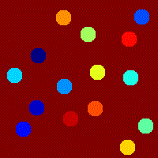

# Growth of nuclei based on neighborhood count rules.

## Description of parameters

### User inputs:
#### Parameters to create initial state of the system
- ***sys_size*** _(int)_: space separated height and width values for system size (e.g. 100 150)
- ***nuclei_pos*** _(str)_: nuclei position. Possible values:
  - 'c'-centre
  - 'r'-random
- ***n_nuclei*** _(int)_: number of nuclei to create in initial system. If 'nuclei_pos'='c', then defaults to 1.
- ***nuclei_shape*** _(str)_: shape of nuclei. Possible value:
  - 'c'-circular
  - 's'-square
- ***nuclei_size*** _(int)_: size of nuclei (radius/side length in pixels)
- ***min_nuclei_spacing*** _(float)_: minimum possible spacing between centres of nuclei. It represents multiple of size i.e. '1' means nuclei can just touch. Defaults to 1.5

#### Parameters to evolve the system over time
- ***nb_size*** _(int)_: size of local neighborhood to use. 3-(3x3), 5-(5x5)
- ***nb_type*** _(str)_: type of neighborhood to use. Possible values:
  - 'm'-Moore
  - 'vn'-Von Newmann
- ***BC_type*** _(str)_: type of boundary condition to use. Possible values:
  - 'p'-periodic
- ***rule*** _(int)_: minimum neighbors needed to change state.
- ***t_steps*** _(int)_: number of time steps for which system will evolve
